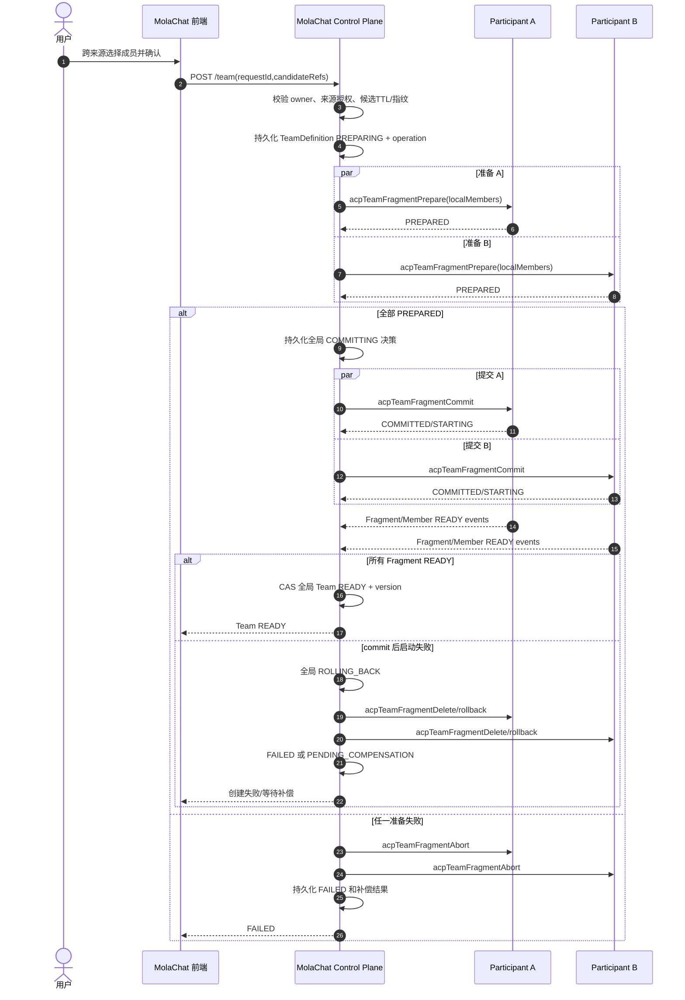

# Fast Team 跨 Chatter 多运行时技术方案

> 状态：技术方案与双方分工已完成，暂不实施
>
> 目标版本：Fast Team V2
>
> 共同维护：MolaChat / Code Cmd Dev
>
> 最后更新：2026-08-01
>
> 实施约束：本文当前仅用于方案与工作项拆分，不授权任何一方实施代码、部署或数据迁移
>
> 双方最终评审结论：选择 MolaChat 全局权威（方案 A）；“本机 cmd-proxy Coordinator 全局权威”（方案 B）已由 cmd-proxy 侧明确撤回

## 1. 背景与目标

Fast Team V1 只能从当前登录 `chatterId` 对应的本机 cmd-proxy 中选择普通 ACP，并将整支 Team 绑定到单个 cmd-proxy transport。

V2 允许用户在创建 Team 时注册一个或多个远程 chatter 来源，分别加载各来源下的普通 ACP，并跨来源选择成员组成同一支 Team。Team ACP 仍在其来源 cmd-proxy 上运行，不复制远端 ACP 的凭据、文件、skills、MCP 或其他运行配置到本机。

目标交互：

1. 创建弹窗的队伍名称下方显示来源 Tab。
2. 第一页固定为当前登录 chatter，即“本机”。
3. 用户可注册远程 chatter，并为其设置易读别名。
4. 每个 Tab 独立拉取该 chatter 下的 ACP 候选。
5. 用户跨 Tab 选择 2～6 个成员，底部统一展示已选成员及其来源。
6. 创建成功后，来自多个 cmd-proxy 的成员在同一 Team 中完成消息、Team talkTo、会话、状态、删除和重连闭环。

## 2. 非目标

- 不把远端普通 ACP 的完整配置或凭据复制到 MolaChat 或其他 cmd-proxy。
- 不直接复用普通 ACP 的运行中会话作为 Team 会话。
- 不允许仅凭一个裸 `chatterId` 未经授权地枚举或启动远端 ACP。
- 不将显示名、robotName、Tab 顺序作为跨实例路由身份。
- V2 首版不追求强一致分布式数据库，也不引入关系型数据库。
- 本方案阶段不修改代码、不部署、不迁移已有 Team。

## 3. 现状约束

### 3.1 V1 单实例假设

- `ownerChatterId -> cmdProxyInstanceId` 是单值绑定。
- `teamId -> cmdProxyInstanceId` 是单值绑定。
- `acpTeamCreate/List/Get/Delete/Send/...` 均发送到同一个 transport。
- Team 事件只接受该 Team 单一绑定实例的回调。
- cmd-proxy 保存完整 `TeamDefinition`，同时承载全部 `TeamMemberRuntime`。

### 3.2 已有能力

- cmd-proxy 通过 discovery 发布稳定 `cmdProxyInstanceId`、`transportGroup`、可见 chatter 和普通 ACP 快照。
- MolaChat 可同时发现多个 cmd-proxy，并通过实例级 transport 调用命令、接收事件。
- 普通 ACP 已有跨 chatter `talkTo` 网关，可复用其“发送方 callback -> MolaChat 路由 -> 目标 cmd-proxy deliver”传输思路。
- V1 已有不可变 `teamId/teamMemberId/acpClientId`、幂等创建删除、状态机、Team event、独立 session/history、删除屏障和运行时恢复基础。

### 3.3 V2 必须拆除的假设

- Team 不能再绑定单一执行实例，必须变为成员级 transport 绑定。
- Team event 不能再以单一实例判断合法性，必须校验事件成员与来源实例的绑定。
- Team talkTo 不能使用 `targetChatterId + targetRobotName` 作为 Team 目标，必须使用不可变 `teamMemberId`。
- Team list/get/delete 不能再假设一次 RPC 可以覆盖所有参与方。

## 4. 核心架构决策

### 4.1 两类权威角色

| 角色 | 所在位置 | 职责 |
|---|---|---|
| Global Team Control Plane | MolaChat | 持久化全局 `TeamDefinitionV2`、操作日志、成员 placement、全局版本和状态；完成鉴权、来源注册、跨 transport saga、事件合并和前端投影 |
| Team Participant | 每个被选成员的来源 cmd-proxy | 持久化本实例负责的 `TeamFragmentV2`，创建并承载本地 Team ACPClient、session、inbox、operation 和 tombstone |

MolaChat 是全局 Team 与成员位置的唯一权威；cmd-proxy 是本实例 Fragment、本地成员运行状态和资源生命周期的唯一权威。MolaChat 不能伪造本地成员 READY，cmd-proxy 也不能自行改变成员 placement 或宣告整个 Team READY。

V2 需要为 MolaChat 增加可恢复的全局 Team 持久化，不再沿用 V1 “MolaChat 只有可重建投影”的限制。现有 `KeyValueFactoryInterface` 只有 save/remove/select/list，不具备 Team V2 所需的版本 CAS、operation journal 和原子状态迁移，不能直接作为已满足要求的全局 Store。V2 必须新增专用 `TeamDefinitionV2Store/TeamOperationStore` 抽象，并为启用的 LevelDB/Redis 等持久层实现等价的 CAS、原子写入、tombstone 和重启恢复语义；只启用 JVM 内存 cache 时不得发布跨实例 Team V2 ready capability。

### 4.2 为什么不把全部成员放到本机运行

- 远端 ACP 配置可能引用仅远端存在的文件、命令、skills、MCP 和代理。
- 复制模型凭据会扩大敏感信息暴露面。
- 用户选择远端实例的语义是让成员在远端环境运行，而非只借用远端配置模板。
- 远端配置变化、权限和资源限制应由远端 cmd-proxy 权威校验。

### 4.3 为什么全局权威放在 MolaChat

- MolaChat 已经是 discovery、鉴权、跨 chatter 网关和 HTTP 控制面，天然看见全部参与实例。
- 若选某个 cmd-proxy 做协调者，还要新增选主、租约、协调者迁移和 split-brain 防护。
- cmd-proxy 的持久化目录只对本机运行时负责，不适合作为跨机器全局成员位置权威。
- MolaChat 持久化全局 placement 后，list/get/delete、事件校验和 talkTo 路由具有单一入口。
- Participant 失联时，MolaChat 仍可展示全局定义、冻结位置、未完成补偿和恢复进度。

### 4.4 路由关系

```text
ownerChatterId -> TeamDefinitionV2[]
(teamId, teamMemberId) -> participantInstanceId + instanceEpoch
sourceRegistrationId -> sourceChatterId -> sourceInstanceId
```

`teamMemberId` 是所有运行命令和 Team talkTo 的最终路由键。`displayName`、`sourceRobotId` 仅用于展示和来源配置解析。

同一个稳定 `cmdProxyInstanceId` 每次 JVM 启动生成新的 `instanceEpoch`。所有 placement、命令和事件都同时绑定 instanceId 与 epoch，用于拒绝旧进程、旧事件和旧路由。

## 5. 来源注册与授权

### 5.1 注册模型

本机来源由系统自动注册，固定排在第一页且不可删除。远端来源由用户添加：

```json
{
  "sourceChatterId": "remote-chatter-id",
  "pairingCode": "short-lived-code",
  "alias": "办公室电脑"
}
```

注册成功后返回：

```json
{
  "sourceRegistrationId": "uuid",
  "sourceChatterId": "remote-chatter-id",
  "alias": "办公室电脑",
  "sourceType": "REMOTE",
  "authorizationState": "ACTIVE",
  "onlineState": "ONLINE"
}
```

推荐配对流程：远端 chatter 先在自己的已登录页面生成一次性 pairing code；Team owner 在创建弹窗输入 `sourceChatterId + pairingCode`；MolaChat 验证代码所属 chatter、TTL 和单次消费状态后建立 grant。配对码的生成与核验属于 MolaChat 鉴权控制面，cmd-proxy 只在候选查询和 Fragment prepare 时最终校验来源 robot 确实属于当前实例快照。

### 5.2 授权约束

- 裸 `chatterId` 只用于定位，不能作为授权证明。
- 推荐由远端生成一次性、短 TTL、单次消费的 pairing code。
- 授权记录绑定 `ownerChatterId + sourceChatterId + sourceRegistrationId`。
- 远端可以撤销授权；撤销后禁止继续查询候选和创建新 Team，但已有 Team 的处理策略见第 16 节待确认项。
- MolaChat 日志不得记录 pairing code、token 或 ACP 敏感配置。
- 候选查询和创建时均重新校验授权状态，不能只在注册时校验一次。

### 5.3 候选引用

前端不提交可篡改的 `sourceGroupId/transportGroup` 组合，而提交 MolaChat 签发的短期不透明 `candidateRef`：

```json
{
  "candidateRef": "signed-or-server-side-reference",
  "sourceRegistrationId": "uuid",
  "sourceLabel": "办公室电脑",
  "sourceType": "REMOTE",
  "sourceOnline": true,
  "displayName": "Open Code",
  "avatar": "...",
  "status": "AVAILABLE"
}
```

服务端解析 `candidateRef` 后得到 `sourceChatterId/sourceInstanceId/sourceTransportGroup/sourceRobotId/sourceGroupId/configFingerprint`。引用必须有 TTL，并在创建时重新验证来源在线、配置指纹和授权。

## 6. 前端交互方案

### 6.1 创建弹窗

```text
队伍名称
┌──────────────────────────────────────────────┐
│ 本机              办公室电脑          ＋添加 │
├──────────────────────────────────────────────┤
│ □ Open Code                                  │
│ ☑ Codex                                      │
│ □ Claude Code                                │
└──────────────────────────────────────────────┘
已选择 3/6：Codex（本机）×  Claude（办公室电脑）×
```

交互规则：

- Tab 切换不清空其他来源的选择。
- 来源别名作为标题，完整 chatterId 放副标题或 tooltip。
- 各 Tab 独立显示加载、空列表、离线、授权失效、失败重试状态。
- 已选成员来源掉线时保留选择并标红，禁止确认，不静默移除。
- 同名 ACP 显示来源；提交身份使用 `candidateRef`，不使用数组下标。
- 全局校验成员总数 2～6，同一来源 ACP 在同一 Team 中不可重复。
- 首版 Tab 超出宽度时横向滚动；来源数量较多时后续可替换为来源选择器。
- 远端来源注册、重命名、撤销与 Team 创建表单状态分离，避免刷新候选时丢失队名和已选项。

### 6.2 Team 列表与成员状态

- Team 行仍显示聚合状态和活动指示灯。
- 成员详情增加 `sourceLabel/sourceOnlineState`。
- 单个参与方失联时 Team 进入 `RECOVERING`，可查看但禁止向失联成员发送新请求。
- 其他在线成员是否继续可用由第 16 节的故障策略决定，前端必须按后端 capability 展示，不能自行推断。

## 7. 数据模型

### 7.1 全局 TeamDefinitionV2（MolaChat）

```json
{
  "schemaVersion": "2",
  "teamId": "uuid",
  "ownerChatterId": "owner",
  "name": "研发小队",
  "state": "PREPARING",
  "desiredState": "READY",
  "version": 1,
  "createRequestId": "uuid",
  "rosterVersion": 1,
  "rosterDigest": "sha256",
  "fragments": [
    {
      "fragmentId": "uuid",
      "participantInstanceId": "remote-instance",
      "transportGroup": "team-acp-remote-instance",
      "instanceEpoch": "jvm-epoch-uuid",
      "desiredState": "READY",
      "observedState": "PREPARED",
      "fragmentVersion": 1,
      "lastSeenAt": 0
    }
  ],
  "members": [
    {
      "teamMemberId": "uuid",
      "acpClientId": "team-acp-uuid",
      "fragmentId": "uuid",
      "participantInstanceId": "remote-instance",
      "instanceEpoch": "jvm-epoch-uuid",
      "sourceChatterId": "remote-chatter",
      "sourceRobotId": "acp-open-code",
      "sourceGroupId": "...",
      "configFingerprint": "...",
      "order": 0,
      "state": "READY"
    }
  ],
  "lastError": null,
  "createdAt": 0,
  "updatedAt": 0,
  "deletedAt": null
}
```

MolaChat 的全局定义不保存来源 ACP 的 token、模型密钥或完整配置，只保存来源引用、配置指纹、展示元数据和 placement。全局操作日志还需保存 `operationId/type/payloadHash/decision/resultSnapshot/retryState`，确保重启后可继续 saga。

### 7.2 TeamFragment（Participant）

```json
{
  "schemaVersion": "2",
  "teamId": "uuid",
  "fragmentId": "uuid",
  "ownerChatterId": "owner",
  "participantInstanceId": "remote-instance",
  "transportGroup": "team-acp-remote-instance",
  "instanceEpoch": "jvm-epoch-uuid",
  "fragmentState": "READY",
  "fragmentVersion": 2,
  "coordinatorVersion": 3,
  "rosterVersion": 1,
  "rosterDigest": "sha256",
  "prepareOperationId": "uuid",
  "commitOperationId": "uuid",
  "deleteOperationId": null,
  "members": [
    {
      "teamMemberId": "uuid",
      "acpClientId": "team-acp-uuid",
      "sourceChatterId": "remote-chatter",
      "sourceRobotId": "acp-open-code",
      "sourceGroupId": "...",
      "configFingerprint": "...",
      "state": "READY",
      "sessionId": "..."
    }
  ]
}
```

Participant 只允许从本实例可见且归属于 `sourceChatterId` 的普通 ACP 解析配置。Fragment 可以保存全队最小通讯录快照，但只能包含 `teamMemberId/displayName/fragmentId/placement`，不得包含远端凭据或完整配置。

### 7.3 MolaChat 路由投影

`TeamMemberDTO` 增加：

- `participantInstanceId`
- `fragmentId`
- `instanceEpoch`
- `sourceRegistrationId`
- `sourceChatterId`
- `sourceLabel`
- `sourceOnlineState`
- `capabilities`

MolaChat 路由缓存：

```text
(teamId, teamMemberId) -> fragmentId + participantInstanceId
                       + transportGroup + instanceEpoch
```

该路由来自 MolaChat 持久化的全局 TeamDefinitionV2；前端投影和运行缓存均可从全局定义重建，不能成为独立权威。

## 8. MolaChat HTTP 契约

| HTTP | 功能 |
|---|---|
| `GET /team/sources` | 查询本机与已授权远端来源 |
| `POST /team/sources/register` | 使用 pairing code 注册远端来源 |
| `PATCH /team/sources/{id}` | 修改来源别名 |
| `DELETE /team/sources/{id}` | 撤销本地注册关系 |
| `GET /team/sources/{id}/candidates` | 查询指定来源的 ACP 候选 |
| `POST /team` | 跨来源幂等创建 Team |
| `GET /team` | 查询 MolaChat 持久化的全局 Team 列表 |
| `GET /team/{teamId}` | 查询全局 Team 与参与方聚合状态 |
| `DELETE /team/{teamId}` | 跨参与方幂等删除 Team |

创建请求：

```json
{
  "chatterId": "current-owner",
  "token": "...",
  "requestId": "uuid",
  "name": "研发小队",
  "members": [
    {"candidateRef": "candidate-ref-1"},
    {"candidateRef": "candidate-ref-2"}
  ]
}
```

MolaChat 完成 token 校验后自行填充 `ownerChatterId`，不能信任前端提供的 owner、instanceId 或 transportGroup。

## 9. cmd-proxy V2 命令契约

### 9.1 Fragment 生命周期命令

| 命令 | 主要字段 | 作用 |
|---|---|---|
| `acpTeamFragmentPrepare` | operationId, payloadHash, teamId, fragmentId, ownerChatterId, coordinatorVersion, placement, prepareLeaseExpiresAt, rosterVersion/digest, contacts, localMembers | 校验本实例、epoch、来源 robot、配额和 roster，原子保存 PREPARED；不启动 ACPClient |
| `acpTeamFragmentCommit` | operationId, teamId, fragmentId, expectedFragmentVersion, coordinatorVersion, instanceEpoch | 持久化 COMMITTED 决策并异步启动本地成员 |
| `acpTeamFragmentAbort` | operationId, teamId, fragmentId, reason, expectedFragmentVersion | 仅回滚未 commit 的 PREPARED fragment |
| `acpTeamFragmentDelete` | operationId, teamId, fragmentId, expectedCoordinatorVersion, expectedFragmentVersion, instanceEpoch | 建立本地删除屏障并幂等清理 |
| `acpTeamFragmentGet/List` | teamId?, fragmentId?, instanceEpoch | 返回 fragment、operation 和本地资源状态 |
| `acpTeamReconcile` | teamId, fragmentId, desiredState, coordinatorVersion, rosterDigest, placement | 比较全局期望与本地观测状态并返回快照 |

### 9.2 成员和 talkTo 命令

| 命令 | 主要字段 | 作用 |
|---|---|---|
| 现有 `acpTeamSend/Cancel/NewSession/ListSessions/RestoreSession/GetStatus/GetContextUsage/MemoryDream` | teamId, teamMemberId, fragmentId, cmdProxyInstanceId, instanceEpoch, coordinatorVersion, ... | 保留命令名，但 V2 强制进行 placement/version/fencing 校验 |
| `acpTeamTalkToRoute` callback | TeamTalkToEnvelopeV2 | 发送端将跨实例 Team 消息交给 MolaChat 网关 |
| `acpTeamTalkToDeliver` | envelope + target placement | 目标 participant 校验后直接投递或进入 BUSY inbox |
| `acpTeamTalkToAck` | messageId, status, reason, versions | 将目标实际 DELIVERED/QUEUED/REJECTED/EXPIRED 结果返回发送侧 |

V1 命令保持不变；V2 使用独立 schema/命令名做 capability 协商，避免新旧端误解析。

所有命令继续使用单个 JSON cmdArg。统一响应包含 `schemaVersion/requestId/operationId/accepted/code/message/data/coordinatorVersion/fragmentVersion/retryable`。同一 operationId 重试必须使用相同 canonical payloadHash，否则返回 `IDEMPOTENCY_CONFLICT`。

## 10. 创建协议



约束：

- MolaChat 的全局 `operationId` 在所有参与方保持一致，并分别记录 canonical payloadHash。
- prepare 只校验并持久化，不启动 ACPClient；MolaChat 必须先持久化 commit 决策，再发送 commit。
- commit 后 Participant 异步启动成员；只有所有 Fragment 回报 READY 后，MolaChat 才把全局 Team 置为 READY。
- 任意重试必须返回同一操作快照，payload 不同返回 `IDEMPOTENCY_CONFLICT`。
- MolaChat 超时不能直接判定失败，必须查询全局 operation 和 Participant Fragment 后继续或补偿。
- create 期间 discovery 更新不得改变已冻结的 `participantInstanceId + instanceEpoch`；旧 epoch 返回必须丢弃并进入 reconcile。
- prepare lease 过期且从未收到 commit 的 PREPARED Fragment 可以安全自 abort；COMMITTED/READY Fragment 不能因 MolaChat 暂时离线自动删除。

## 11. 成员命令与事件路由

### 11.1 命令路由

发送、取消、session、状态和 context 等成员命令统一使用：

```text
Team RobotChatter
  -> teamId + teamMemberId
  -> MolaChat member route
  -> participant transportGroup
  -> participant TeamClientRegistry(teamId, teamMemberId)
```

参与方必须同时校验 `teamId/teamMemberId/fragmentId/instanceEpoch/coordinatorVersion/acpClientId`，禁止仅按显示名或 source robotName 定位。`ownerChatterId` 只用于授权，不能再用于选择 cmd-proxy。

### 11.2 事件路由

事件至少增加：

```json
{
  "teamId": "uuid",
  "teamMemberId": "uuid",
  "fragmentId": "uuid",
  "participantInstanceId": "instance-id",
  "transportGroup": "team-acp-instance-id",
  "instanceEpoch": "jvm-epoch-uuid",
  "coordinatorVersion": 3,
  "fragmentVersion": 2,
  "eventId": "uuid",
  "memberEventSeq": 18,
  "type": "MESSAGE_CHUNK"
}
```

MolaChat 接收事件时按全局 TeamDefinitionV2 的 placement 验证：

1. Team 存在且未完成删除。
2. member 属于 Team。
3. member 当前绑定的 fragment、participant 和 instanceEpoch 与已认证事件 transport 一致。
4. coordinatorVersion/fragmentVersion 未过期。
5. `eventId/memberEventSeq` 未重复或回退。

跨 participant 不共享全局 eventSeq。eventSeq 只在 `fragmentId + instanceEpoch` 内单调；MolaChat 按 eventId 去重，并用 coordinatorVersion + fragmentVersion 合并状态。发现序列缺口时拉取 Fragment 快照，不能用迟到事件回退全局状态。

## 12. 跨实例 Team talkTo

普通跨 chatter talkTo 的网关传输可以复用，但 Team 目标协议改为不可变成员身份：

```json
{
  "messageId": "uuid",
  "teamId": "uuid",
  "senderFragmentId": "uuid",
  "senderInstanceId": "instance-id",
  "senderInstanceEpoch": "jvm-epoch-uuid",
  "coordinatorVersion": 3,
  "rosterVersion": 1,
  "senderTeamMemberId": "uuid",
  "targetTeamMemberId": "uuid",
  "content": "...",
  "contentDigest": "sha256",
  "depth": 1,
  "createdAt": 0,
  "expiresAt": 0
}
```

流程：

1. 发送方 participant 从本 Team 冻结通讯录解析用户输入的目标。
2. 发送方回调 MolaChat，不直接信任模型提供的 chatterId、transportGroup 或 robotName。
3. MolaChat 从全局 TeamDefinitionV2 解析目标 placement，并从已认证 callback transport 反查发送实例；不信任 payload 自报身份。
4. MolaChat 校验发送者、目标、Team state、coordinatorVersion/rosterVersion 和成员 placement。
5. MolaChat 调用目标 transport 的 `acpTeamTalkToDeliver`。
6. 目标 participant 再次校验 fragment 白名单、epoch、TTL 和 messageId，READY 直接投递，BUSY 进入本地 inbox。
7. 目标返回 `DELIVERED/QUEUED/REJECTED/EXPIRED`；MolaChat 通过 `acpTeamTalkToAck` 或 Team event 投影回发送成员。

去重键使用 `teamId + messageId`，重复 deliver 返回首次 ACK，不能重复注入 ACPClient。发送 callback 的初始结果最多表示 `GATEWAY_ACCEPTED`，在目标确认前不能向用户显示“已成功送达”。删除进入 `DELETING` 后，MolaChat 和参与方都拒绝新 talkTo。网关不可用时返回 `GATEWAY_UNAVAILABLE`，严禁逃逸到普通 crossTalkTo。显示名冲突在创建前生成稳定 alias 或直接拒绝，工具协议最终仍使用 `teamMemberId`。

## 13. 删除、补偿与恢复

### 13.1 删除

1. MolaChat 在全局 TeamDefinitionV2 中持久化 `DELETING` 屏障和 delete operation；此后拒绝 send、talkTo、schedule 和 newSession。
2. MolaChat 按冻结的 fragment/placement 清单并行调用 `acpTeamFragmentDelete`。
3. Participant 执行 cancel -> session/end -> destroy -> forcibly，并清理 registry、executor、inbox、通讯录和去重状态。
4. 全部参与方返回已删除或已有 tombstone 后，MolaChat CAS 全局状态为 `DELETED` 或 `DELETED_WITH_WARNINGS`，并保存全局 tombstone。
5. MolaChat 删除 RobotChatter 投影和关联 Session。

某参与方离线时 Team 保持 `DELETING/PENDING_COMPENSATION`，后台 reaper 在其重新上线后继续清理。不得因局部超时删除全局路由和 tombstone。

### 13.2 MolaChat 重启

- 从全局 TeamDefinitionV2、operation journal 和 tombstone 重建 Team 与成员路由。
- 对 `CREATING/PREPARING/COMMITTING/ROLLING_BACK/RECOVERING/DELETING/PENDING_COMPENSATION` Team 查询所有 participant fragment。
- 在 discovery/heartbeat 恢复后，根据全局持久化决策继续 commit、abort、delete 或 reconcile，不能仅凭内存状态猜测。

### 13.3 Participant 重启

- 从本地 fragment journal 恢复其负责成员。
- 未提交的 PREPARED fragment 不自动对外接受请求。
- READY fragment 重启时先进入 RECOVERING，恢复后向 MolaChat 发布带 instanceEpoch/coordinatorVersion/fragmentVersion 的 snapshot/event。
- coordinatorVersion、rosterDigest 或 placement epoch 不匹配的孤儿 fragment 进入隔离状态，等待 reconcile/reaper，不直接接收消息。

### 13.4 MolaChat 暂时离线与实例代际切换

- 已 READY 成员允许完成已经开始的本地 turn，但新的跨实例 talkTo 明确返回 `GATEWAY_UNAVAILABLE`，不能回退普通 crossTalkTo。
- COMMITTED/READY Fragment 不因 MolaChat 暂时离线自动删除；PREPARED 可在 prepareLease 到期且未见 commit 决策时自 abort。
- 同一 instanceId 新 JVM 上线后产生新的 instanceEpoch。MolaChat 只接受当前 placement epoch 的事件，旧 epoch 迟到事件直接丢弃。
- 实例替换必须由 MolaChat 显式提升 placement epoch 并执行恢复或重建；旧实例不能自行继续作为目标。
- MolaChat 全局持久层永久丢失属于控制面灾难，依靠 MolaChat 持久层备份/恢复处理；不得从任意 Fragment 多数状态拼装新的全局权威，也不得把某个 cmd-proxy 自动提升为 Coordinator。

## 14. 状态、错误码与可观测性

### 14.1 状态

全局 Team：

```text
CREATING -> PREPARING -> COMMITTING -> READY
PREPARING/COMMITTING -> ROLLING_BACK -> FAILED
ROLLING_BACK -> PENDING_COMPENSATION -> FAILED
READY -> RECOVERING -> READY/ROLLING_BACK
任意非终态 -> DELETING -> DELETED/DELETED_WITH_WARNINGS
DELETING -> PENDING_COMPENSATION -> DELETED/DELETED_WITH_WARNINGS
```

Participant fragment：

```text
PREPARING -> PREPARED -> STARTING -> READY/FAILED
PREPARED -> ABORTING -> ABORTED
READY -> RECOVERING -> READY/FAILED
STARTING/READY/RECOVERING/FAILED -> DELETING
DELETING -> DELETED/DELETED_WITH_WARNINGS
```

`abort` 只允许尚未 commit 的 PREPARED Fragment；commit 已持久化后失败必须走 rollback/delete 补偿。

### 14.2 新增错误码

| 错误码 | 含义 |
|---|---|
| `SOURCE_NOT_REGISTERED` | 远端来源未注册 |
| `SOURCE_AUTH_EXPIRED` | 来源授权已过期或被撤销 |
| `SOURCE_OFFLINE` | 来源 transport 不在线 |
| `CANDIDATE_REF_EXPIRED` | 候选引用过期 |
| `CANDIDATE_CHANGED` | 来源 ACP 或配置指纹变化 |
| `PARTICIPANT_NOT_READY` | 参与方业务命令未就绪 |
| `PARTICIPANT_MISMATCH` | 成员与来源实例绑定不一致 |
| `TEAM_GENERATION_MISMATCH` | Team 实例代际不一致 |
| `TEAM_PARTIAL_FAILURE` | 分布式创建或删除出现局部失败 |
| `TEAM_CLEANUP_PENDING` | 尚有参与方资源等待清理 |
| `TEAM_TARGET_FORBIDDEN` | talkTo 目标不属于当前 Team |
| `STALE_COORDINATOR_VERSION` | 命令携带的全局版本过旧 |
| `RECONCILE_REQUIRED` | 本地与全局版本出现缺口，需要快照对账 |
| `INSTANCE_EPOCH_MISMATCH` | 命令或事件来自错误 JVM 代际 |
| `ROSTER_VERSION_MISMATCH` | Team 通讯录版本或摘要不一致 |
| `GATEWAY_UNAVAILABLE` | MolaChat Team 网关当前不可用 |

### 14.3 日志和指标

日志统一携带：

```text
requestId, operationId, teamId, fragmentId, teamMemberId, ownerChatterId,
participantInstanceId, instanceEpoch, coordinatorVersion, fragmentVersion, operation, state
```

指标至少包括：来源注册成功/失败、候选查询延迟、participant prepare/activate/delete 延迟、局部失败数、补偿重试数、孤儿 fragment 数、跨实例 talkTo 投递/排队/失败数、事件来源校验失败数。

日志不得输出 token、pairing code、完整 prompt、模型密钥或来源 ACP 配置正文。

## 15. 兼容与迁移

- discovery 增加 V2 capability 和命令清单；没有 V2 capability 的 cmd-proxy 仍可使用 V1 本机 Team。
- discovery 增加 `teamProtocolVersion=2`、每次 JVM 启动唯一的 `instanceEpoch`、capabilities 和 heartbeatAt；稳定 instanceId 继续代表同一数据根。
- V1 Team 保持 `schemaVersion=1` 和单实例路由，不能运行中自动升级为 V2。
- 新建 Team 仅选择本机成员时，可继续走 V1；若使用远端来源则 MolaChat 和所有 Participant 都必须支持 V2。
- 前端在来源 Tab 上展示能力状态，不允许选择未升级 participant 的 ACP 创建 V2 Team。
- V1 与 V2 的命令、持久化目录或 schema 必须可区分，reaper 不得互相清理。

## 16. 已暂定策略（实施前复核）

| 编号 | 问题 | 当前建议 |
|---|---|---|
| D-01 | 是否强制一支跨来源 Team 同时包含至少一个本机和一个远端成员 | 不强制；总成员 2～6 且 placement 均通过授权即可 |
| D-02 | 远端授权撤销后已有 Team 如何处理 | 立即禁止该来源的新建和新命令；已有 Team 进入 RECOVERING 并记录 `SOURCE_AUTH_EXPIRED`，只保留查看与幂等删除入口，不自动假删除远端资源 |
| D-03 | Participant 短时失联时其他在线成员是否继续 send | 首版允许在线成员已有本地会话 send，但暂停跨实例 talkTo；Team 显示 RECOVERING |
| D-04 | MolaChat 网关失联时 participant 是否继续运行 | 允许完成已有本地 turn；拒绝新跨实例 talkTo，COMMITTED/READY Fragment 不自动删除 |
| D-05 | Team talkTo 对模型暴露显示名还是不可变 ID | UI 展示别名；工具 target 使用 teamMemberId，prompt 同时提供别名映射 |
| D-06 | 来源注册信息保存位置 | MolaChat 现有 owner 级 KV；pairing secret 只保存不可逆摘要或短期凭据 |
| D-07 | cmd-proxy 是否需要彼此直连 | 不直连；统一经 MolaChat gateway 编排，保持现有 RPC 方向 |
| D-08 | MolaChat 全局 TeamDefinitionV2 的具体存储实现 | 新增专用 TeamDefinitionV2/Operation Store；LevelDB/Redis 后端必须提供等价 CAS、原子迁移、tombstone 和恢复语义，现有通用 KV 不直接复用，纯内存模式不启用 V2 |

## 17. 工作项与双方分工

状态仅允许：`未开始`、`进行中`、`已完成`、`阻塞`。以下均是未来实施工作项，本次全部保持 `未开始`，不得据此直接实施。

### 17.1 公共契约

| ID | 工作项 | 负责人 | 依赖 | 验收标准 | 状态 |
|---|---|---|---|---|---|
| FTR-001 | 冻结 V2 标识、Global TeamDefinition/Participant/Fragment 模型 | 双方 | 无 | 双方 DTO 样例一致，明确所有权威边界 | 未开始 |
| FTR-002 | 冻结 V2 命令、事件、错误码与 capability | 双方 | FTR-001 | JSON contract fixtures 可被双方解析 | 未开始 |
| FTR-003 | 冻结来源授权、candidateRef 和撤销策略 | 双方 | FTR-001 | 威胁模型和正常/过期/撤销用例明确 | 未开始 |
| FTR-004 | 冻结部分失联、MolaChat 网关失联和恢复策略 | 双方 | FTR-001 | 第 16 节所有决策关闭 | 未开始 |

### 17.2 cmd-proxy（Code Cmd Dev）

| ID | 工作项 | 依赖 | 验收标准 | 状态 |
|---|---|---|---|---|
| FTR-CMD-101 | V2 协议模型：TeamFragment、MemberPlacement、RosterSnapshot、错误码和状态机 | FTR-001,FTR-002 | 与 MolaChat contract fixtures 字段和状态含义一致 | 未开始 |
| FTR-CMD-102 | Discovery fencing：instanceEpoch、protocolVersion=2、capabilities、heartbeat 快照 | FTR-CMD-101 | 同 instanceId 新旧 JVM 代际可区分，旧 epoch 被拒绝 | 未开始 |
| FTR-CMD-103 | FragmentStore/Manager：CAS、operation、tombstone、prepare lease、恢复 | FTR-CMD-101 | 原子持久化；重启恢复；错误版本/epoch 不可写 | 未开始 |
| FTR-CMD-104 | Prepare/Commit/Abort/Delete/Reconcile 命令 | FTR-CMD-103,FTR-002 | 幂等、payloadHash、CAS、稳定 resultSnapshot 测试通过 | 未开始 |
| FTR-CMD-105 | 本地来源强校验、成员创建及 placement/version 路由保护 | FTR-CMD-103,FTR-CMD-104 | 仅本实例来源可启动；所有成员命令强校验 fragment/epoch/version | 未开始 |
| FTR-CMD-106 | 跨实例 Team talkTo Route/Deliver/Ack、去重、TTL 和 inbox | FTR-CMD-101,FTR-CMD-105 | 伪造 sender、跨 Team、旧版本、重复消息和深度超限均拒绝 | 未开始 |
| FTR-CMD-107 | Fragment 事件、快照、恢复、补偿和实例代际切换 | FTR-CMD-103～106 | 单端重启、离线删除续跑、序列缺口快照修复闭环 | 未开始 |
| FTR-CMD-108 | 安全、限流、配额、指标和契约测试 | FTR-CMD-104～107 | 凭据不出实例；资源/消息限制生效；审计字段齐全 | 未开始 |
| FTR-CMD-109 | cmd-proxy V1/V2 回归、双实例联调和 fat jar 验证 | FTR-CMD-101～108 | 受影响测试与完整 Maven 测试通过，Failures/Errors=0、BUILD SUCCESS、diff check 通过 | 未开始 |

### 17.3 MolaChat 后端与前端

| ID | 工作项 | 依赖 | 验收标准 | 状态 |
|---|---|---|---|---|
| FTR-MOLA-101 | 来源注册、pairing 授权、撤销与 owner 级存储 | FTR-003 | 不能凭裸 chatterId 枚举远端 ACP | 未开始 |
| FTR-MOLA-102 | 多实例 discovery 索引、instanceEpoch fencing 与 sourceRegistration 路由 | FTR-MOLA-101,FTR-CMD-102 | 同 chatter 多实例不随机选择，旧 JVM 代际被去除 | 未开始 |
| FTR-MOLA-103 | candidateRef 签发、TTL、指纹和创建时复验 | FTR-MOLA-102 | 篡改、过期、离线、配置变化均被拒绝 | 未开始 |
| FTR-MOLA-104 | 专用 TeamDefinitionV2/Operation Store、placement、CAS 和 tombstone 持久化 | FTR-001,FTR-004 | LevelDB/Redis 语义一致；MolaChat 重启不丢全局状态或未完成决策；纯内存模式不发布 V2 ready | 未开始 |
| FTR-MOLA-105 | Prepare/Commit saga 创建编排器、超时查询与失败补偿 | FTR-MOLA-103,FTR-MOLA-104,FTR-CMD-104,FTR-CMD-105 | 所有 Fragment READY 后全局才 READY；局部失败无可用孤儿成员 | 未开始 |
| FTR-MOLA-106 | 成员级 send/cancel/session/status 路由改造 | FTR-MOLA-105,FTR-CMD-105 | 不再依赖 owner/team 单实例绑定 | 未开始 |
| FTR-MOLA-107 | Fragment event 认证、去重/乱序合并、快照补洞和全局状态聚合 | FTR-MOLA-104,FTR-MOLA-105,FTR-CMD-107 | 合法多来源事件接收，伪造/旧 epoch 事件拒绝，状态不回退 | 未开始 |
| FTR-MOLA-108 | Team talkTo 跨 transport gateway 与 ACK 回传 | FTR-MOLA-104,FTR-CMD-106 | sender 反查、目标权威路由、实际投递状态准确 | 未开始 |
| FTR-MOLA-109 | V2 删除 saga、pending compensation、后台 reconcile 与重启恢复 | FTR-MOLA-104,FTR-CMD-104,FTR-CMD-107 | 离线参与方不导致全局假删除，恢复后续删 | 未开始 |
| FTR-MOLA-110 | 创建弹窗来源 Tab、来源管理和跨 Tab 选择 | FTR-MOLA-101,FTR-MOLA-103 | 桌面/移动端跨 Tab 选择不丢失，状态和来源清晰 | 未开始 |
| FTR-MOLA-111 | Team 列表成员来源、RECOVERING 与能力门禁 | FTR-MOLA-105,FTR-004 | 局部失联行为与冻结策略一致 | 未开始 |
| FTR-MOLA-112 | MolaChat 后端、前端与 V1 回归 | FTR-MOLA-101～111 | 鉴权、路由、UI、普通 ACP、V1 Team 回归通过 | 未开始 |
| FTR-MOLA-113 | Nginx 静态资源同步与部署验收清单 | FTR-MOLA-112 | 源码、运行静态目录 hash 一致；仅在实施获批后执行 | 未开始 |

### 17.4 联调与故障验证

| ID | 场景 | 负责人 | 依赖 | 验收标准 | 状态 |
|---|---|---|---|---|---|
| FTR-INT-201 | 本机 1 成员 + 远端 1 成员创建/send/talkTo/delete | 双方 | 双方核心工作项 | 全链路无串线、无残留 | 未开始 |
| FTR-INT-202 | 三个 participant、同名 ACP 与并发 talkTo | 双方 | FTR-INT-201 | 不按显示名误路由，消息去重有效 | 未开始 |
| FTR-INT-203 | prepare/commit 各阶段超时与重复请求 | 双方 | FTR-INT-201 | 最终 READY 或完整补偿，无重复 client | 未开始 |
| FTR-INT-204 | Participant 运行中断线、重启、恢复 | 双方 | FTR-CMD-107,FTR-MOLA-109 | Team 状态正确，恢复后路由代际一致 | 未开始 |
| FTR-INT-205 | MolaChat 重启、旧/新 instanceEpoch 交替上线 | 双方 | FTR-INT-204 | 全局定义、路由、操作状态可重建，旧代事件被 fencing | 未开始 |
| FTR-INT-206 | 删除时 participant 离线后重连 | 双方 | FTR-INT-204 | PENDING_COMPENSATION 最终转 DELETED | 未开始 |
| FTR-INT-207 | 授权过期/撤销、候选篡改和伪造事件 | 双方 | FTR-003,FTR-MOLA-107 | 全部拒绝并有审计，日志不泄密 | 未开始 |
| FTR-INT-208 | 100 次跨实例 create/delete 资源回收 | cmd-proxy 主责，MolaChat 配合 | FTR-INT-201 | clients/process/executor/inbox/fragment 无增长 | 未开始 |
| FTR-INT-209 | V1/V2 混合版本与回滚 | 双方 | FTR-CMD-109,FTR-MOLA-112 | 旧端不误调用 V2，V1 Team 可正常使用 | 未开始 |

## 18. 推荐实施顺序与并行边界

1. 双方先完成 FTR-001～004，只冻结文档和 contract fixtures。
2. cmd-proxy 完成 Fragment 持久化和 fencing 基础；MolaChat 并行完成全局 TeamDefinitionV2 持久化、来源授权原型和 UI 静态交互，但不接真实创建。
3. cmd-proxy 提供 create/fragment mock 或测试 transport 后，MolaChat 实现 V2 编排器。
4. 成员级 send/event 路由稳定后再接 Team talkTo，避免同时调试两套跨实例链路。
5. create/send/talkTo 闭环稳定后再实现分布式 delete/reconcile。
6. 双方单测通过后按 FTR-INT-201～209 渐进联调，一次只引入一个故障变量。
7. 所有验收完成并经用户明确批准后，才能部署 cmd-proxy、MolaChat 和 Nginx 静态资源。

代码所有权边界：

- Code Cmd Dev 负责 cmd-proxy 的 Participant、TeamFragment、本地 operation/tombstone、Team ACPClient、Fragment 事件和本地资源生命周期。
- MolaChat 负责全局 TeamDefinitionV2、全局 operation/tombstone、成员 placement、用户鉴权、来源授权、候选引用、跨 transport saga、HTTP、前端和 RobotChatter/Session 投影。
- 公共命令、DTO、状态机和错误码必须先在本文或双方 contract fixture 中确认，任何一方不得单边扩展后要求另一方适配。

## 19. 明确不采用的方案

1. **仅在现有 `/team/candidates` 增加任意 chatterId 参数**：缺少授权且不能解决成员级 transport 路由。
2. **把远端 ACP 配置复制到本机 cmd-proxy**：泄露凭据并破坏环境一致性。
3. **用 robotName/displayName 做跨实例 Team 路由**：同名、改名和多 Team 复制都会产生歧义。
4. **只在 MolaChat 内存保存全局 Team 权威**：MolaChat 重启会丢失进行中操作；V2 必须使用可恢复持久化、CAS、operation journal 和 tombstone。
5. **创建失败立即删除全局记录并返回普通失败**：局部 participant 可能仍有资源，必须保留补偿状态和操作证据。
6. **删除时某参与方离线就直接标记 DELETED**：会产生孤儿 ACPClient、schedule、inbox 和会话资源。
7. **让 cmd-proxy 彼此直接建立新的任意网络连接**：首版继续经 MolaChat 网关，复用现有连接和鉴权边界。
8. **选某个 cmd-proxy 作为全局 Team Coordinator**：会额外引入选主、租约、迁移和 split-brain；cmd-proxy 只负责本地 Fragment。
9. **多个 cmd-proxy 保存可多写的完整 TeamDefinition**：会产生全局版本冲突和成员 placement 分裂。
10. **heartbeat/TTL 失联即自动删除已 commit Fragment**：TTL 只能影响路由可用性和 PREPARED lease，不能替代持久化删除决策。

## 20. 实施准入条件

当前方案和分工已完成，但不表示获准实施。只有以下条件全部满足后，双方才能把工作项从 `未开始` 改为 `进行中`：

- Code Cmd Dev 已完成 cmd-proxy 侧评审；其确认负责 FTR-CMD-101～109，且当前未修改代码。
- 双方已明确选择 MolaChat 全局权威方案 A；cmd-proxy 侧已撤回方案 B，后续不得重新引入隐式 Coordinator 或自动选主。
- 第 16 节暂定策略经实施前复核无变更，或变更已同步到双方 contract fixtures。
- 双方确认 MolaChat 全局权威、Participant 本地权威和重启恢复路径。
- 双方确认来源授权不是裸 chatterId 信任。
- FTR-001～004 的 contract fixtures 和状态迁移样例一致。
- 用户明确批准进入实施阶段。
