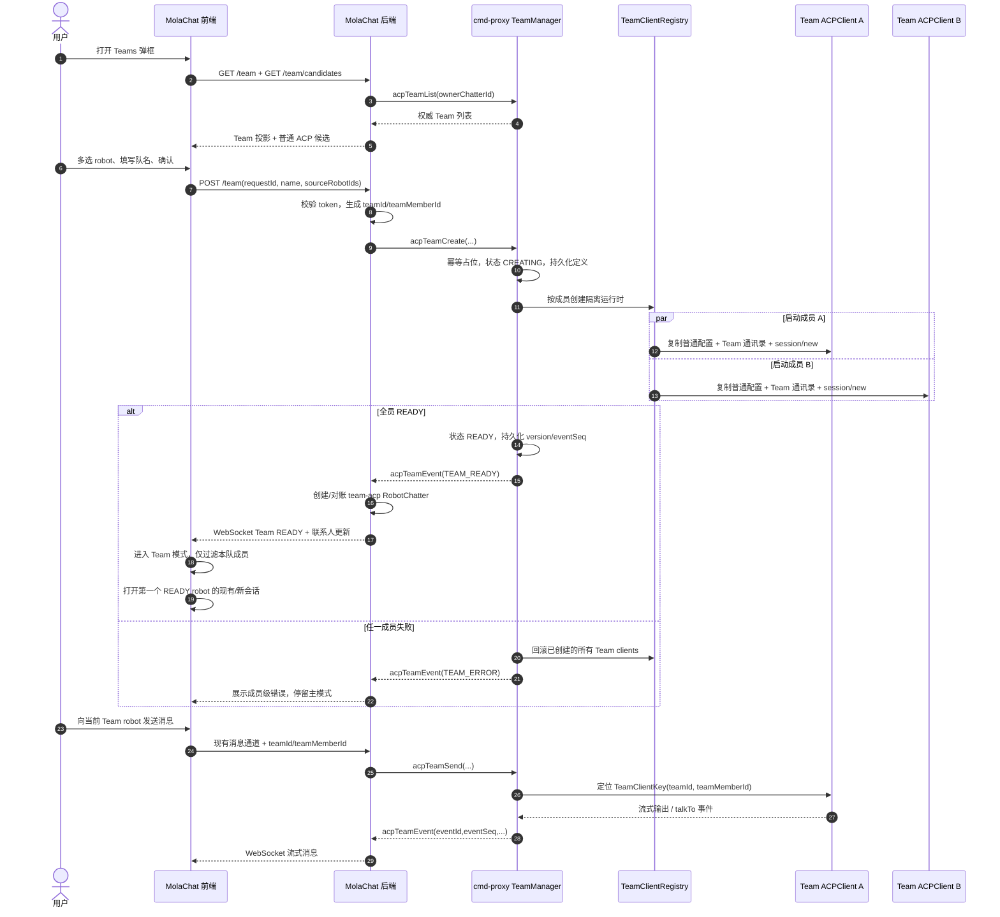
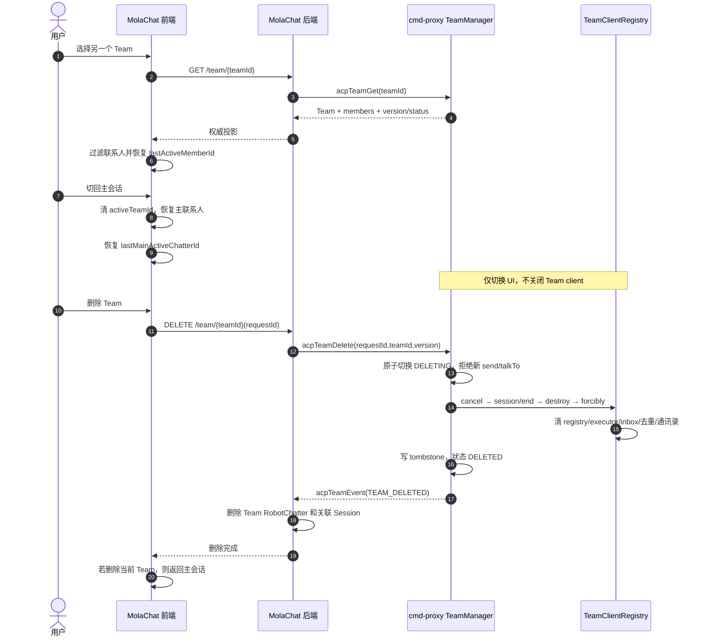
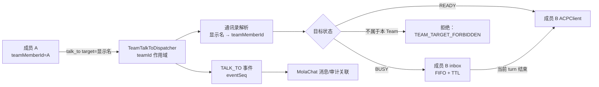

# Fast Team 技术实施方案

> 状态：设计中  
> 共同维护：MolaChat / Code Cmd Dev  
> 主文档唯一合并者：MolaChat 侧 Agent  
> 最后更新：2026-07-30

## 1. 文档维护规则

- 本文是 Fast Team 唯一技术实施与进度主表。
- MolaChat 负责人直接维护本文中的公共契约、MolaChat 实施项和总进度。
- Code Cmd Dev 在 cmd-proxy 工作区维护其来源章节，完成后通知 MolaChat 负责人合并，不直接并发修改本文。
- 功能实施时必须同步更新第 7 节进度表；状态只能使用：`未开始`、`进行中`、`已完成`、`阻塞`。
- `已完成` 必须同时满足：代码完成、责任方测试通过、本文“完成证据”列写入测试命令或结果。
- 公共接口或模型变更必须先更新第 4 节契约，再分别改代码，防止两端各自猜测字段。

## 2. V1 已确认决策

1. cmd-proxy 是 Team 定义、成员身份、状态机与 ACP 运行时的单一权威源。
2. MolaChat 保存可重建的页面投影、消息关联和设备 UI 状态，通过 `acpTeamList/Get` 对账。
3. `teamId`、`teamMemberId` 使用不可变 UUID；`robotId/acpClientId=team-acp-{teamMemberId}`。
4. `robotGroup=team-acp` 只作逻辑分类，Team 不进入普通 `acpSyncRobots`。
5. RPC 使用 cmd-proxy 实例级稳定 `transportGroup=team-acp-{cmdProxyInstanceId}`；V1 不给 Team/member 动态注册 RPC group。
6. Team 内每个成员拥有独立 ACPClient、进程、session、executor 和历史命名空间 `team/{teamId}/{teamMemberId}`。
7. Team client 强制创建新 session，不恢复来源 robot 的主会话历史。
8. 除 talkTo 通讯录被替换为本 Team 白名单外，Team ACP 的 schedule、memory 正常读写、MCP、模型、代理、skills、subAgent、权限和其他配置均与普通模式一致。
9. 同一来源 robot 在同一 Team 中只能出现一次，可以同时加入多个 Team。
10. 创建采用全有或全无；删除采用 `DELETING` 屏障和幂等清理。
11. 创建成功后进入 Team 模式，左侧仅显示队员，并打开用户选择顺序中的第一个 READY robot。
12. Teams 入口同时存在于 `#menu` 子按钮；并将当前仅切换侧栏显示的 `#tool-contacts` 替换为 Teams 快捷入口。

## 3. 整体流程

### 3.1 创建、进入与消息流



### 3.2 切换与删除流



### 3.3 talkTo 队内路由



## 4. 新增模型、数据承载与双方契约

### 4.1 标识与分组

| 字段 | 示例 | 生成/权威方 | 用途 |
|---|---|---|---|
| `teamId` | UUID | MolaChat 创建请求预生成；cmd-proxy 固化 | Team 不可变主键与幂等创建 |
| `teamMemberId` | UUID | MolaChat 创建请求预生成；cmd-proxy 固化 | 成员不可变主键 |
| `robotId/acpClientId` | `team-acp-{teamMemberId}` | 双方确定性生成 | MolaChat robot 与 cmd-proxy client 关联 |
| `robotGroup` | `team-acp` | 固定契约 | MolaChat 逻辑分类 |
| `transportGroup` | `team-acp-{cmdProxyInstanceId}` | cmd-proxy | 实例级稳定 RPC 地址 |
| `sourceGroupId` | 现有普通 ACP group | MolaChat 提交，cmd-proxy校验 | 解析来源 robot 配置与归属 |
| `sessionId/groupId` | MolaChat 会话 ID | MolaChat session 模块 | 用户与 Team robot 的聊天消息归档 |

注意：`robotGroup`、`transportGroup`、`sourceGroupId`、MolaChat `sessionId` 是四种不同概念，代码和接口禁止复用同一个含糊的 `groupId` 字段表达它们。

### 4.2 cmd-proxy 权威模型

| 模型 | 核心字段 | 运行承载 | 持久化 |
|---|---|---|---|
| `TeamDefinition` | teamId、ownerChatterId、name、state、version、transportGroup、createRequestId、members、时间、lastError | `TeamManager` 索引 | cmd-proxy 数据目录中的版本化 JSON；原子临时文件 + rename |
| `TeamMemberDefinition` | teamMemberId、acpClientId、sourceRobotName、sourceGroupId、displayName、remark、order、state、sessionId、configFingerprint | `TeamRuntime.members` | 随 TeamDefinition 持久化，不保存凭据 |
| `TeamOperationRecord` | requestId、CREATE/DELETE、payloadHash、status、resultSnapshot、TTL | `TeamManager.operations` | `$CMD_PROXY_HOME/teams/operations/`，保障幂等 |
| `TeamRuntime` | definition、generation、operationLock、eventSeq、acceptingRequests、members、dispatcher | JVM 内存 | 只将恢复所需 journal 字段落盘 |
| `TeamMemberRuntime` | TeamClientKey、AcpClientIdentity、configSnapshot、client、listener、ScheduleOwnerKey、state | JVM 内存 | sessionId/historyNamespace/configFingerprint 写 journal |
| `TeamClientRegistry` | `(teamId, teamMemberId) → client` | JVM `ConcurrentMap` | 不单独持久化，由 Team 定义恢复 |
| `AcpClientIdentity` | scope、logicalId、transportGroup、historyNamespace、owner/team/member/source | JVM client 字段 | 必要恢复字段随 runtime journal |
| `TeamContactRef` | targetTeamMemberId、targetAcpClientId、displayName、remark | 每 Team 通讯录 | 创建时冻结，V1 不单独持久化 |
| `ScheduleOwnerKey` | scope、ownerId、teamId、teamMemberId、persistencePath | `TeamScheduleRegistry` | 决定独立 schedule 文件路径 |
| `TeamTalkToDispatcher` | 通讯录、inbox、去重状态、TTL | 每 Team JVM 内存 | V1 不持久化；删除时显式清理 |
| `TeamEvent` | eventId、eventSeq、teamId、teamMemberId、type、data、timestamp | 内存事件缓冲 | journal/有限事件窗口，用于断线对账 |
| `DeleteTombstone` | teamId、requestId、version、deletedAt、cleanupResult | JVM 索引 | cmd-proxy 数据目录，支持重试幂等和 reaper |

不使用关系型数据库。cmd-proxy 已是本地 ACP 运行时权威，V1 使用“内存运行态 + 本地版本化 JSON/journal”能避免新增数据库依赖；敏感配置只从来源 robot 解析，不复制进 Team 文件。

cmd-proxy 持久化布局：

```text
$CMD_PROXY_HOME/
  teams/{teamId}/team.json
  teams/{teamId}/runtime.json
  teams/operations/{requestId}.json
  teams/tombstones/{teamId}.json
  session/team/{teamId}/{teamMemberId}/{sessionId}/...
  schedules/team/{teamId}/{teamMemberId}/tasks.json
  team-archive/{teamId}/...
```

所有权威文件先写同目录临时文件、flush，再原子 move；状态迁移成功落盘后才对外发布。Team 删除会归档会话历史，但不删除已经正常写入的长期 memory。

### 4.3 MolaChat 模型

| 模型/字段 | 核心内容 | 承载方式 | 说明 |
|---|---|---|---|
| `TeamDTO` | teamId、ownerChatterId、name、status、version、members | 请求期内存/前端投影 | 来自 `acpTeamList/Get`，不是权威数据 |
| `TeamMemberDTO` | teamMemberId、acpClientId、robotId、displayName、avatar、order、status | 请求期内存/前端投影 | 不含 cmd-proxy 凭据或完整配置 |
| `RobotChatter` 新字段 | teamId、teamMemberId、robotGroup=`team-acp`、visibleChatterIds | 现有 ChatterFactory | 随部署模式落在现有内存、Redis 或 LevelDB，不新增 Team 数据库 |
| `ChatterDTO` 新字段 | teamId、teamMemberId | WebSocket/HTTP DTO | 前端联系人过滤和消息路由 |
| `TeamEventDTO` | eventId、eventSeq、teamId、teamMemberId、acpClientId、type、data、timestamp | 回调处理内存 | 去重、状态更新、流式消息转换 |
| `TeamViewState` | activeTeamId、lastMainActiveChatterId、lastActiveMemberIds | 浏览器 `localStorage` | 设备级 UI 状态；服务端校验后才使用 |
| Team 聊天消息 | 复用现有 Session/Message | 现有 SessionFactory | 随部署模式落在内存、Redis 或 LevelDB |

MolaChat 不新增 TeamDefinition 数据库表。Teams 弹框打开、重连或版本不一致时从 cmd-proxy 对账；本地 `RobotChatter` 只是供现有联系人/Session 机制使用的投影，可删除并重建。

### 4.4 命令契约

| 命令 | 主要请求字段 | 主要响应 |
|---|---|---|
| `acpTeamCreate` | requestId、teamId、ownerChatterId、name、members[{teamMemberId,sourceRobotId,sourceGroupId,order}] | ACCEPTED/错误、transportGroup、version |
| `acpTeamList` | ownerChatterId、sinceVersion? | Team 摘要列表、最新版本 |
| `acpTeamGet` | ownerChatterId、teamId | Team 和逐成员权威状态 |
| `acpTeamSend` | teamId、teamMemberId、acpClientId、sessionId、message、files? | ACCEPTED/状态错误 |
| `acpTeamCancel` | teamId、teamMemberId、acpClientId、sessionId | 取消结果 |
| `acpTeamNewSession` | teamId、teamMemberId | 新建该 Team member 的隔离 session |
| `acpTeamListSessions` | teamId、teamMemberId、limit? | 仅列出该 member history namespace |
| `acpTeamRestoreSession` | teamId、teamMemberId、sessionId | 仅允许恢复该 member namespace |
| `acpTeamGetStatus` | teamId、teamMemberId? | Team 或 member 状态 |
| `acpTeamGetContextUsage` | teamId、teamMemberId | 上下文使用率 |
| `acpTeamDelete` | requestId、ownerChatterId、teamId、expectedVersion | ACCEPTED/ALREADY_DELETED/冲突 |

统一回调 `acpTeamEvent`：

```json
{
  "eventId": "uuid",
  "eventSeq": 18,
  "teamId": "uuid",
  "teamMemberId": "uuid",
  "acpClientId": "team-acp-uuid",
  "transportGroup": "team-acp-instance-id",
  "teamVersion": 3,
  "type": "TEAM_CREATE_ACCEPTED|TEAM_READY|TEAM_CREATE_FAILED|TEAM_STATE_CHANGED|MEMBER_STATE_CHANGED|MESSAGE_CHUNK|MESSAGE_COMPLETE|MESSAGE_ERROR|TOOL_CALL|TALK_TO_SEND|TALK_TO_RECEIVE|TALK_TO_QUEUED|SCHEDULE_EVENT|COMPACTION_EVENT|TEAM_DELETED|TEAM_SNAPSHOT_READY",
  "data": {},
  "timestamp": 0
}
```

### 4.5 HTTP 契约（MolaChat 前端）

| HTTP | 功能 |
|---|---|
| `GET /team` | 当前登录用户的 Team 列表 |
| `GET /team/candidates` | 当前用户可用于组队的普通 ACP robot |
| `GET /team/{teamId}` | Team 详情与成员状态 |
| `POST /team` | 幂等创建 Team |
| `DELETE /team/{teamId}` | 幂等删除 Team |

所有接口使用现有 `chatterId + token` 校验；MolaChat 后端从已验证身份填充 `ownerChatterId`，不能信任前端提交任意 owner。

## 5. 功能点明细

### 5.1 Phase 0：cmd-proxy 身份与生命周期基础

- 引入显式 `ClientIdentity(scope, logicalId, transportGroupId, historyNamespace)`。
- 新增隔离的 `TeamManager`、`TeamClientRegistry`、`TeamTalkToDispatcher`。
- Team history namespace 不得读取普通 robot 的 `lastSessionId`。
- 改造 ACP client 优雅关闭：`session/cancel → session/end → wait → destroy → destroyForcibly`。
- create/delete/send/talkTo 使用 Team 状态机、generation/version 和生命周期锁。
- cmd-proxy stop/reload/shutdown 纳入 `TeamManager.closeAll()`。
- 建立配额、启动 semaphore、超时与后台 reaper。

### 5.2 Team 列表与候选成员

- MolaChat 后端查询 cmd-proxy 权威 Team 列表。
- 候选只包含当前用户可见的普通 `robotGroup=acp` robot。
- BUSY 可选；ERROR、disabled、onlySubAgent 不可选。
- 同一来源 robot 在当前 Team 多选中不可重复。
- Team 行展示队名、最多 3 个头像、成员数、状态和删除按钮。

### 5.3 创建 Team

- 前端多选 2~6 个成员并填写 trim 后 1~40 字符队名。
- MolaChat 生成 requestId/teamId/teamMemberId 和用户选择顺序。
- cmd-proxy 校验归属、幂等、配额与来源配置，持久化 CREATING 占位。
- 受控并行创建独立 Team clients；除 talkTo contacts 外完整继承普通 ACP 配置。
- 全员 READY 才发布 Team 通讯录和 TEAM_READY；失败时全量回滚。
- 前端创建期间禁止重复提交，展示创建进度和成员级错误。

### 5.4 MolaChat Team robot 投影

- 使用 `robotId=team-acp-{teamMemberId}` 创建 `RobotChatter`。
- `robotGroup=team-acp`，设置 teamId/teamMemberId 和 `visibleChatterIds={ownerChatterId}`。
- Team robot 完全绕开普通 `acpSyncRobots`，用 Team 事件/list/get 独立对账。
- 删除投影时关闭该 robot 的所有 MolaChat Session。
- 联系人推送在 owner 维度过滤，不能让其他用户看见 Team robot。

### 5.5 进入与切换 Team 模式

- `#menu` 增加 Teams 子按钮。
- `#tool-contacts` 原侧栏开关行为替换为 Teams 快捷入口。
- Teams 使用独立 bottom-sheet，不修改历史用户弹框的数据流和样式职责。
- 创建成功或点击 READY Team 后，只渲染该 Team 的成员。
- 首次打开选择顺序中的第一个 READY 成员；再次进入优先 `lastActiveMemberId`。
- 切换 UI 不取消后台 turn、不销毁 Team clients。
- 切回主会话恢复普通联系人和 `lastMainActiveChatterId`。
- 页面刷新后读取本地 view state，再经服务端校验；失效则回主会话。

### 5.6 Team 消息与事件

- MolaChat 根据 Team robot 的 teamId/teamMemberId 调用 `acpTeamSend`，不走普通 `acpSendMessage`。
- cmd-proxy 只用 `(teamId, teamMemberId)` 定位 client，禁止按显示名或 robotName 路由。
- MESSAGE_CHUNK 通过现有 MolaChat 流式消息能力进入对应 Session。
- eventId 去重，eventSeq 防止重复/乱序导致状态回退。
- 后台输出在切换页面后继续接收；重新进入时从现有 Session 恢复消息。
- talkTo 事件至少保留发送者、接收者、时间和状态；正文展示可后续配置。

### 5.7 Team talkTo

- 每个 Team 建立临时白名单通讯录，不写普通 robot contacts 或配置文件。
- Team prompt 将“可联系未列出 Agent”改成严格白名单语义。
- 显示名解析成 teamMemberId 后投递；同名冲突必须在创建时拒绝或生成稳定 alias。
- READY 直接投递，BUSY 进入 member inbox；容量、FIFO、TTL 配置化。
- 删除 Team 时停止入口并清 inbox、去重与通讯录。
- 除通讯录作用域外，schedule、memory 正常写入及其他 ACP 行为与普通模式一致。

### 5.8 Schedule、Memory 与完整配置继承

- Team schedule 不能继续以 `robotName` 作为唯一 owner；使用 `ScheduleOwnerKey(scope=TEAM, teamId, teamMemberId)`。
- Team task 写入 `$CMD_PROXY_HOME/schedules/team/{teamId}/{teamMemberId}/tasks.json`，普通 task 目录保持兼容。
- Team 定时任务到期后只路由到相同 `(teamId, teamMemberId)`；BUSY 时按普通模式进入 WAITING/重试。
- schedule 触发新 session 时重新装配 memory、subAgent、MCP、Team talkTo、权限和其他正常能力。
- Team 删除停止该 Team 的 schedule owner，并清 WAITING/RUNNING task；执行中任务进入统一 cancel/end 屏障。
- `MemoryConfig` 的 readEnabled、writeEnabled、scope、baseDir 等全部继承，不因 Team 模式关闭写入。
- workspace/robot memory scope 保持来源 robot 的正常语义；Team 删除不删除长期 memory。
- 主 client 与多个 Team client 可能并发写同一 memory store，使用 `MemoryManagerRegistry/MemoryScopeLock` 按真实 storage key 复用 manager 或串行化索引写入。
- dispatch_subagent 继续使用正常子 Agent 配置，不能被 Team talkTo 白名单误拦截。
- ability 结果优先复用来源 robot 的服务/缓存，避免每个 Team member 重复启动能力反思进程。

### 5.9 删除与异常恢复

- 删除按钮阻止行点击冒泡，并使用包含队名/成员数的二次确认。
- cmd-proxy 原子进入 DELETING 后立即拒绝新 send/talkTo。
- 清理完成写 tombstone 并发 TEAM_DELETED；重复请求返回相同结果。
- 单成员强杀失败时可返回 DELETED_WITH_WARNINGS，由 reaper 继续回收。
- 删除当前 Team 后返回主会话；非当前 Team 不改变当前视图。
- cmd-proxy 重启后从定义/journal 恢复为 RECOVERING，MolaChat 用 list/get 对账。
- 回调只用于实时加速，不能成为一致性的唯一来源。

### 5.10 验证与上线

- 单测覆盖身份/历史隔离、幂等、状态机竞态、talkTo 白名单、事件去重。
- 联调覆盖创建、切换、主会话恢复、后台流式输出、删除与重启。
- 回归普通 ACP send/new/restore/cancel、schedule、memory、全局 talkTo、robot reload。
- 重复创建/删除 100 次后，进程、线程、registry、inbox 和文件句柄回到基线。
- MolaChat 静态资源精确同步到 Nginx `molaapp` 目录，并进行 SHA-256 校验。

## 6. 预计代码改动

### 6.1 MolaChat

| 位置 | 改动 |
|---|---|
| `src/main/resources/templates/index.html` | Teams 双入口、bottom-sheet、创建表单、引入 `team.js` |
| `src/main/resources/static/css/styles.css` | Team 列表、多选、状态、删除确认和移动端样式 |
| `src/main/resources/static/js/chat/team.js`（新增） | 查询、创建、切换、回主会话、删除、view state |
| `src/main/resources/static/js/app/nav.js` | `tool-contacts` 改为打开 Teams，不再切换侧栏 |
| `src/main/resources/static/js/chat/chatter.js` | 联系人按 MAIN/TEAM 模式集中筛选 |
| `chatter/model/RobotChatter.java` | 新增 teamId/teamMemberId |
| `chatter/dto/ChatterDTO.java` | 新增 teamId/teamMemberId |
| `team/controller/TeamController.java`（新增） | HTTP API、token 与 owner 校验 |
| `team/solution/TeamSolution.java`（新增） | CmdSender 调用、投影对账和删除 |
| `team/dto/*`（新增） | Team、Member、Create、Event DTO |
| `robot/solution/CmdProxyCallbackSolution.java` | 注册并处理 `acpTeamEvent` |
| `robot/solution/AcpRobotSyncSolution.java` | 明确普通 ACP group 边界，禁止影响 team-acp |
| `robot/handler/impl/acp/AcpExecHandler.java` | Team robot 消息改走 `acpTeamSend/Cancel` |

### 6.2 cmd-proxy

路径以 `cmd-proxy-app/src/main` 为基准。

新增文件：

| 位置 | 作用 |
|---|---|
| `java/.../acp/team/TeamManager.java` | Team 权威状态机与编排 |
| `java/.../acp/team/TeamStore.java` | definition、operation、tombstone 原子持久化 |
| `java/.../acp/team/TeamClientRegistry.java` | `(teamId, teamMemberId) → AcpClient` |
| `java/.../acp/team/TeamCommandHandler.java` | `acpTeam*` 参数校验和调用 |
| `java/.../acp/team/TeamResourceReaper.java` | 孤儿进程、任务、归档和中间态回收 |
| `java/.../acp/team/model/*` | Team/Member/State/Operation/Tombstone/Error/ContactRef |
| `java/.../acp/team/runtime/*` | TeamRuntime、TeamMemberRuntime |
| `java/.../acp/team/talkto/*` | Team dispatcher、context injector、remark resolver |
| `java/.../acp/team/listener/TeamAcpResponseListener.java` | 统一 TeamEvent callback |
| `java/.../acp/team/event/*` | TeamEventEnvelope 与 sequencer |
| `java/.../acp/team/protocol/*` | command/result/event DTO 与 schemaVersion |
| `java/.../acp/acpclient/AcpClientIdentity.java` | 显式 client 身份 |
| `java/.../acp/acpclient/AcpClientFeatureInitializer.java` | 普通/Team 共用能力装配 |
| `java/.../acp/schedule/ScheduleOwnerKey.java` | MAIN/TEAM schedule owner |
| `java/.../acp/memory/MemoryManagerRegistry.java` | 同 memory scope manager/锁复用 |

修改文件：

| 位置 | 改动 |
|---|---|
| `acp/acpclient/AbstractAcpClient.java` | identity、协议优先 close、lifecycle guard |
| `acp/acpclient/AcpClient.java` | historyNamespace、schedule owner、可插拔 talkTo、关闭状态保护 |
| `acp/acpclient/context/ConversationHistoryManager.java` | 显式安全 namespace，禁止路径逃逸 |
| `acp/acpclient/AcpClientRegistry.java` | 保持只管理 MAIN，或增加 scope 防误收 Team |
| `acp/schedule/ScheduleTaskManager.java` | robotName key 泛化为 ScheduleOwnerKey |
| `acp/schedule/model/ScheduledTask.java` | owner/schemaVersion 兼容字段 |
| `acp/memory/MemoryManager.java` | 配合 registry/共享锁，读写语义不变 |
| `acp/talkto/TalkToContextInjector.java` | 保持普通行为，抽取可复用 remark 逻辑 |
| `kotlin/.../acp/AcpProxy.kt` | TeamManager、transport、公共能力装配、stop/closeAll |
| `kotlin/.../Main.kt` | 启动 Team 模块，传入 instanceId/transportGroup |
| `utils/CmdProxyHome.java` | Team、archive、schedule 路径 helper |
| `client/provider/CmdReceiver.kt` | 注册实例级 Team group；V1 不要求 unregister |
| `acp/common/InstanceRegistry.java` | 暴露实例 transport discovery（若需要） |

cmd-proxy 测试至少新增 TeamManager、TeamStore、幂等、生命周期竞态、talkTo、schedule、memory、reaper 和协议契约测试。

## 7. 功能分工与进度

> 每次实施后更新“状态、完成证据、最后更新”。公共契约任务需要双方确认后才可标记已完成。

| ID | 阶段 | 功能点 | 负责人 | 状态 | 依赖 | 完成证据 | 最后更新 |
|---|---|---|---|---|---|---|---|
| FT-001 | 契约 | 冻结 ID、分组、状态、命令与事件字段 | 双方 | 进行中 | 无 | 两份审阅已对齐，待 DTO/接口常量落码 | 2026-07-30 |
| FT-002 | Phase 0 | ClientIdentity 与 Team history namespace | Code Cmd Dev | 已完成 | FT-001 | `AcpClientIdentityTest` 4/4、`ConversationHistoryManagerTest` 6/6；安全 namespace/目录穿越覆盖 | 2026-07-30 |
| FT-003 | Phase 0 | ACP 优雅关闭和 lifecycle lock | Code Cmd Dev | 已完成 | FT-001 | Shutdown 5/5、Lifecycle 3/3、Conflict 2/2；移除 PID kill；Phase 0 合计 20/20 | 2026-07-30 |
| FT-004 | Phase 0 | TeamManager 与 TeamClientRegistry | Code Cmd Dev | 已完成 | FT-002、FT-003 | 最小容器、恢复不启动 client、TEAM identity 校验、stop 幂等关闭；本批累计 39/39 | 2026-07-30 |
| FT-005 | Phase 0 | TeamTalkToDispatcher、白名单与清理 | Code Cmd Dev | 已完成 | FT-004 | 严格队内白名单、FIFO inbox、TTL/去重/depth/清理完成；联系人 JSON 卡片及 SEND/RECEIVE/QUEUED/REJECTED 可视卡片补齐；cmdproxy 96/96 | 2026-07-30 |
| FT-006 | Phase 0 | Team 定义/journal/tombstone 持久化 | Code Cmd Dev | 进行中 | FT-004 | TeamStore 原子写、next-version CAS、operation/tombstone namespace 已完成；待 runtime journal/恢复闭环 | 2026-07-30 |
| FT-007 | cmd API | 实例级 transportGroup 与 Team 命令注册 | Code Cmd Dev | 已完成 | FT-001、FT-004 | 实例级 transport、discovery 与 13 个 Team 命令（含 memoryDream）已注册；businessCommandsReady=true；cmdproxy 102/102 | 2026-07-30 |
| FT-008 | cmd API | create/list/get 全有或全无与幂等 | Code Cmd Dev | 已完成 | FT-006、FT-007 | 配置快照/fingerprint、全员并行启动、120s 超时、READY/FAILED v2 与全量回滚；cmdproxy 累计 63/63 | 2026-07-30 |
| FT-009 | cmd API | send/cancel 与统一 TeamEvent | Code Cmd Dev | 已完成 | FT-005、FT-007 | 11 个命令、消息/成员状态事件与文件校验已落地；cmdproxy 69/69 | 2026-07-30 |
| FT-010 | cmd API | delete 屏障、资源清理与 reaper | Code Cmd Dev | 已完成 | FT-003～FT-007 | DELETING 双版本屏障、幂等 tombstone、全资源清理、7 天 history 归档、60s reaper 与恢复完成；cmdproxy 92/92 | 2026-07-30 |
| FT-024 | cmd 能力 | ScheduleOwnerKey、Team task 持久化/路由/删除 | Code Cmd Dev | 已完成 | FT-004、FT-006 | `ScheduleOwnerKey`、Team 分层任务目录、成员级 callback/session 替换及删除清理完成；本批 cmdproxy 85/85 | 2026-07-30 |
| FT-025 | cmd 能力 | Memory 正常读写继承与并发写保护 | Code Cmd Dev | 已完成 | FT-004 | `MemoryManagerRegistry` 统一复用；按规范化存储目录的公平锁及最新 index 合并写入完成；Team 删除保留共享 memory | 2026-07-30 |
| FT-026 | cmd 能力 | MCP/model/proxy/subAgent/permission/compaction/ability 完整继承 | Code Cmd Dev | 已完成 | FT-004 | 共用 AcpClientFeatureInitializer、完整来源配置快照及普通/Team 同路径验证完成；cmdproxy 69/69 | 2026-07-30 |
| FT-027 | cmd API | Team session/status/context/memoryDream 与 BUSY cancel | Code Cmd Dev | 已完成 | FT-004、FT-007 | BUSY cancel 状态矩阵、memoryDream sourceGroupId/共享 MemoryManager 路由和 session 命令完成；cmdproxy 102/102 | 2026-07-30 |
| FT-011 | Mola 后端 | Team DTO、HTTP API 与鉴权 | MolaChat | 已完成 | FT-001 | DTO、token/owner 校验、候选与 create/list/get/delete HTTP API 全部接入 | 2026-07-30 |
| FT-012 | Mola 后端 | cmdproxy Team 命令客户端封装 | MolaChat | 已完成 | FT-007、FT-011 | 13 个 Team 命令接入；取消/新会话/dream 返回纯文本，session list 与主会话同 Markdown 表格，restore 成功静默；不再泄露运行时 JSON；联合定向 31/31 | 2026-07-30 |
| FT-013 | Mola 后端 | TeamEvent 回调、去重与状态处理 | MolaChat | 已完成 | FT-009、FT-011 | 普通/Team 共用 AcpResponseContentRenderer；tool/subAgent/schedule/compaction/talkTo 卡片经 MESSAGE_CHUNK 同序透传，错误 content 原样结束流；cmdproxy 126/126、Mola 联合 29/29 | 2026-07-30 |
| FT-014 | Mola 后端 | Team RobotChatter 投影与 Session 清理 | MolaChat | 已完成 | FT-008、FT-013 | Team 作用域增删改、删除 Session 清理及事件接入完成；验证不影响普通或其他 Team robot | 2026-07-30 |
| FT-015 | Mola 前端 | Teams 双入口与操作弹框 | MolaChat | 进行中 | FT-011 | 双入口、bottom-sheet、列表/空态；能力状态区分未启用/未连接、初始化、登录失效和检查失败，未就绪禁用创建；待浏览器复验 | 2026-07-30 |
| FT-016 | Mola 前端 | 候选多选、队名与创建进度 | MolaChat | 进行中 | FT-012、FT-015 | 仅在线 AVAILABLE 普通 ACP 可选；来源失效/配置变化/配额错误中文化并提示刷新重选；Team 联合 31/31，待浏览器复验 | 2026-07-30 |
| FT-017 | Mola 前端 | MAIN/TEAM 联系人过滤与联系人页展示 | MolaChat | 进行中 | FT-014～FT-016 | MAIN 隐藏 team-acp、TEAM 仅本队；按最新交互取消模拟点击和自动开成员，切换后停留联系人页；待浏览器实测 | 2026-07-30 |
| FT-018 | Mola 前端 | Team 切换、回主会话和当前状态展示 | MolaChat | 进行中 | FT-017 | activeTeam 设备状态、当前 Team 行高亮/标识、仅 CREATING/RECOVERING→READY 的 toast+notify 已落地；待浏览器实测 | 2026-07-30 |
| FT-019 | Mola 前端 | 删除确认、删除中与失败重试 | MolaChat | 进行中 | FT-010、FT-014、FT-015 | 二次确认、DELETING 门禁、同 requestId/expectedVersion 重试、成功切主会话与刷新已落地；待浏览器联调 | 2026-07-30 |
| FT-020 | 联调 | 创建/消息/talkTo/切换/删除与单端重启闭环 | 双方 | 进行中 | FT-008～FT-019 | cmdproxy 增加不可变 sync snapshot；MolaChat 启动主动握手并以 0/1/2/4/8/16s 有限退避恢复普通+Team discovery；联合定向 25/25，待真实单端重启验证 | 2026-07-30 |
| FT-021 | 验证 | 并发、重启、100 次资源回收与普通 ACP 回归 | Code Cmd Dev | 已完成 | FT-020 | 配额原子性、删除竞态、100 次 create→delete 五类资源逐轮归零；cmdproxy 96/96、package/fat-jar 通过 | 2026-07-30 |
| FT-022 | 验证 | UI 桌面/移动端、Session、鉴权与事件回归 | MolaChat | 进行中 | FT-020 | dev HTTPS 8550 启动成功，index/team.js 200 且哈希一致；待登录后桌面/移动交互与业务事件回归 | 2026-07-30 |
| FT-023 | 部署 | MolaChat 静态资源同步和 SHA-256 校验 | MolaChat | 已完成 | FT-022 | 首批 5 个文件已同步；本轮 team.js/styles.css 再同步并逐项 SHA-256 一致，目标 team.js 语法通过 | 2026-07-30 |

### 7.1 cmd-proxy 细分进度来源

Code Cmd Dev 在其工作区维护更细的实现任务，主表按以下映射同步，不重复由两人修改同一状态：

| 主表 | cmd-proxy 细分 ID | 范围 |
|---|---|---|
| FT-002～FT-003 | FT-CMD-001～005 | identity、history、优雅关闭、generation、误杀防护 |
| FT-004、FT-006～008 | FT-CMD-101～107、201～203 | 模型、store、manager、transport、create/list/get、事件与 client 创建 |
| FT-009、FT-027 | FT-CMD-204 | send/cancel/session/status/context usage |
| FT-026 | FT-CMD-205～206 | 正常能力装配与 ability 复用 |
| FT-005 | FT-CMD-301～305 | Team talkTo 全链路 |
| FT-024～FT-026 | FT-CMD-401～406 | Schedule、Memory、完整配置一致性 |
| FT-010 | FT-CMD-501～505 | 删除、恢复、reaper、shutdown |
| FT-021 | FT-CMD-601～605 | 测试、资源验收、回归、观测与配额 |
| FT-020 | FT-CMD-606 | MolaChat contract 联调 |

cmd-proxy 进度来源文件：

`/home/mola/IdeaProjects/cmd-proxy/docs/fast-team-implementation-cmdproxy-section.md`

## 8. 实施顺序与并行边界

1. 双方先完成 FT-001，并各自建立相同的命令/事件字段常量或 DTO 测试样例。
2. Code Cmd Dev 串行完成 FT-002、FT-003，再开展 FT-004～FT-007；身份与关闭基础未完成前不接 Team UI 真调用。
3. MolaChat 可并行完成 FT-011 和 FT-015 的静态骨架，但使用 mock 数据；不提前固化未确认的 cmd 响应细节。
4. FT-008/FT-009 有可测接口后，MolaChat 完成 FT-012～FT-018。
5. FT-010 与 FT-019 完成后进入 FT-020 联调。
6. 两端验证全部通过后再做 FT-023 部署同步。

## 9. 实施前仍需锁定的契约细节

这些事项不阻塞 cmd-proxy Phase 0 和 MolaChat 静态 UI 骨架，但必须在 FT-001 完成前确定：

1. `schemaVersion` 初始值及向前/向后兼容规则。
2. `acpTeamEvent` 在现有 RPC 中采用直接 JSON，还是当前 `resultMap<String,String>` 编码。
3. `cmdProxyInstanceId/transportGroup` 由哪个现有 discovery 响应返回给 MolaChat。
4. MolaChat 预生成 teamId/teamMemberId 后，cmd-proxy 是直接固化还是允许重新分配；默认建议只校验并固化，不重新分配。
5. V1 cmd-proxy 重启后 Team member 是创建新 session，还是恢复 journal 中原 session；默认建议 V1 创建新 session、保留历史供显式恢复。
6. event 短期补拉是否进入 V1；若不进入，MolaChat 以 Session 消息和 list/get 状态对账兜底。
7. member remark 是否允许用户编辑；默认使用 ability.md 摘要 → signature → 默认说明的优先级自动生成。

## 10. V1 非目标

- 跨 cmd-proxy 实例组队。
- Team/member 动态 RPC group。
- Team 聚合时间线。
- 广播、队长、单成员离队、成员增删。
- Team 历史会话 list/restore UI。
- 多设备同步当前 activeTeam。
- 新增关系型数据库或分布式 Team 存储。
